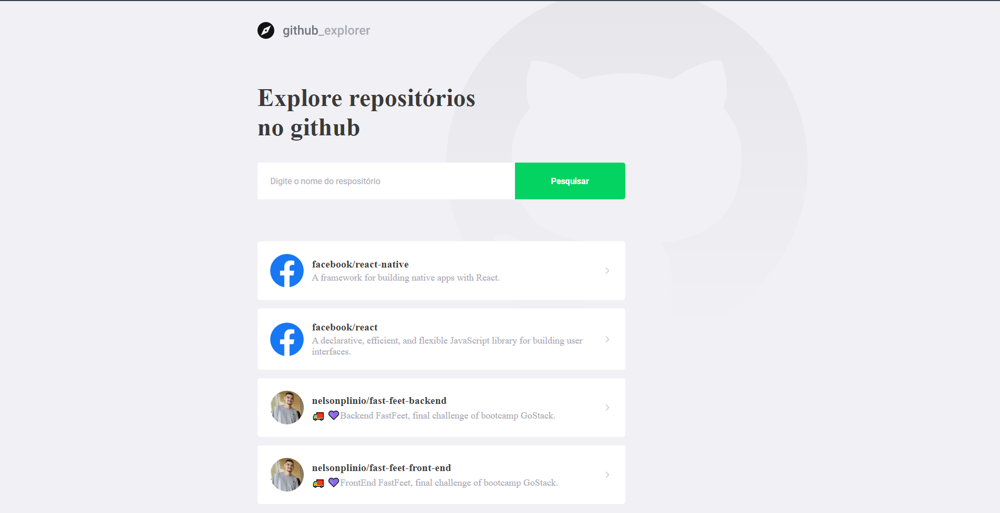

<h1 align="center">
    
</h1>

  <a href="#rocket-sobre-o-desafio">Sobre</a>&nbsp;&nbsp;&nbsp;|&nbsp;&nbsp;&nbsp;
  <a href='#gear-oque-foi-utilizado'>Oque foi utilizado</a>&nbsp;&nbsp;&nbsp;|&nbsp;&nbsp;&nbsp;
  <a href="#camera-imagens">Imagens</a>&nbsp;&nbsp;&nbsp;|&nbsp;&nbsp;&nbsp;
  <a href="#Instalar e usar">Instalar e usar</a>

## 🔎 Sobre

Projeto desenvolvido no nivel 3 da nova jornada do <strong>bootcamp GoStack</strong> utilizando <strong>Typescript</strong>.

 

## ⚙️ Oque foi utilizado

  - React
  - React hooks
  - Axios
  - Typescript
  - polished
  - eslint
  - prettier
  - styled-components
  - react-icons
  - react-router-dom
  - Api do github

## 📷 Imagens

<strong></strong>

 

 

## 🚀 Instalar e usar

###### Clone o respostiorio. 
``git clone git@github.com:nelsonplinio/github-explore-go.git``

###### Instalar as dependencias. 
``cd github-explore-go ``
`` yarn ou npm install``

###### Instalar as dependencias. 
``yarn start ou npm run start ``
